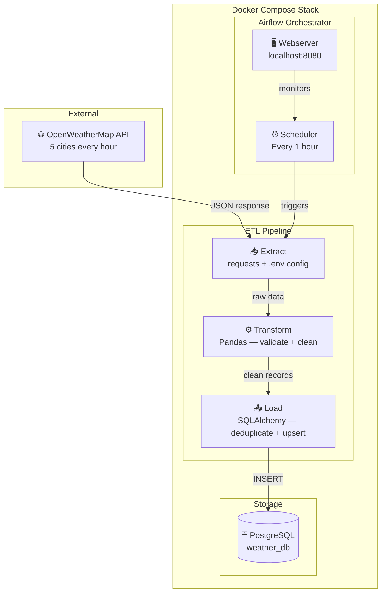

# 🌦️ Weather ETL Pipeline


An automated, production-grade ETL pipeline that extracts real-time weather data from the OpenWeatherMap API, transforms and validates it with Python and Pandas, loads it into PostgreSQL, and orchestrates the full workflow with Apache Airflow — all containerized with Docker Compose.

Built as part of my Data Engineering portfolio to demonstrate end-to-end pipeline design, orchestration, and containerized infrastructure.

---

## 📐 Architecture



### Data Flow

1. **Airflow scheduler** triggers the `weather_etl` DAG every hour
2. **Extract** calls OpenWeatherMap API for Paris, London, New York, Tokyo and Douala
3. **Transform** normalises temperatures, validates data types and handles missing values with Pandas
4. **Load** inserts clean records into PostgreSQL with deduplication — safe to retry without duplicates
5. **Airflow webserver** at localhost:8080 provides live DAG monitoring, task logs and retry controls

---

### How it works

1. **Extract** — Calls the OpenWeatherMap REST API for 5 cities and returns raw JSON records
2. **Transform** — Cleans nulls, validates and casts data types, removes duplicates, and adds a derived `temp_category` column (freezing / cold / mild / warm / hot)
3. **Load** — Inserts clean records into PostgreSQL using SQLAlchemy, with duplicate detection on `(city, recorded_at)` to ensure idempotency

---

## 🛠️ Tech Stack

| Layer | Technology | Purpose |
|---|---|---|
| Orchestration | Apache Airflow 2.8.1 | DAG scheduling, retries, monitoring |
| Database | PostgreSQL 13 | Persistent storage for weather records |
| Containerization | Docker & Docker Compose | Reproducible, portable environment |
| Language | Python 3.8 | Pipeline logic |
| Data Processing | Pandas, SQLAlchemy | Transformation and DB interaction |
| External API | OpenWeatherMap REST API | Live weather data source |

---

## ✨ Features

- **Hourly automation** — Airflow triggers the pipeline every hour without manual intervention
- **5 cities tracked** — Paris, London, New York, Tokyo, Douala across 4 continents
- **Robust transformation** — handles missing values, validates types, enriches data with derived columns
- **Idempotent loading** — duplicate records detected and skipped on every run — safe to retry
- **Retry logic** — each task retries 2 times with a 5-minute delay on failure
- **One-command setup** — entire stack starts with a single Docker Compose command
- **Clean separation of concerns** — extract, transform and load are fully independent modules
- **8 unit tests** — covering temperature conversion, humidity range, wind speed, pressure and city list
- **CI/CD** — GitHub Actions runs tests automatically on every push

## 📊 Pipeline Metrics

| Metric | Value |
|---|---|
| Cities tracked | 5 — Paris, London, New York, Tokyo, Douala |
| Continents covered | 4 — Europe, Americas, Asia, Africa |
| Pipeline schedule | Every 1 hour |
| Records per run | 5 records — 1 per city |
| Records per day | ~120 records |
| Retry attempts | 2 retries with 5-minute delay |
| Unit tests | 8 passing |
| CI status | GitHub Actions — passing |
| Deployment | Docker Compose — 3 containers |
| Setup time | Under 2 minutes |

---

## 📁 Project Structure

```
weather-etl-pipeline/
│
├── dags/
│   └── weather_etl_dag.py        # Airflow DAG — schedule, task order, retry config
│
├── scripts/
│   ├── extract.py                # Hits OpenWeatherMap API, returns raw records
│   ├── transform.py              # Cleans and validates data using Pandas
│   ├── load.py                   # Loads clean data into PostgreSQL via SQLAlchemy
│   └── init_db.sql               # Creates DB, user, table schema and indexes
│
├── docker-compose.yml            # Spins up Airflow webserver, scheduler, PostgreSQL
├── requirements.txt              # All Python dependencies
├── .env.example                  # Environment variable template (safe to commit)
├── .gitignore                    # Excludes logs, cache, .env, data
└── README.md
```

---

## 🗄️ Database Schema

```sql
CREATE TABLE weather_data (
    id                   SERIAL PRIMARY KEY,
    city                 VARCHAR(100)  NOT NULL,
    country              VARCHAR(10),
    temperature          FLOAT,                    -- °C
    feels_like           FLOAT,                    -- °C
    humidity             INTEGER,                  -- %
    pressure             INTEGER,                  -- hPa
    weather_description  VARCHAR(255),             -- e.g. "light rain"
    wind_speed           FLOAT,                    -- m/s
    visibility           INTEGER,                  -- metres
    recorded_at          TIMESTAMP     NOT NULL,   -- timestamp from API
    inserted_at          TIMESTAMP     DEFAULT CURRENT_TIMESTAMP
);

-- Indexes for fast querying by city and time
CREATE INDEX idx_weather_city        ON weather_data(city);
CREATE INDEX idx_weather_recorded_at ON weather_data(recorded_at);
```

---

## 🚀 How to Run

### Prerequisites

- [Docker Desktop](https://www.docker.com/products/docker-desktop/) installed and running
- Free API key from [OpenWeatherMap](https://openweathermap.org/api)

### Step-by-step

**1. Clone the repository**

```bash
git clone https://github.com/OjongBessongNKONGHO/weather-etl-pipeline.git
cd weather-etl-pipeline
```

**2. Configure environment variables**

```bash
cp .env.example .env
```

Open `.env` and replace `your_api_key_here` with your OpenWeatherMap API key.

**3. Initialize Airflow (first time only)**

```bash
docker-compose up airflow-init
```

Wait until you see:

```
airflow-init-1  | User "admin" created with role "Admin"
airflow-init-1  | 2.8.1
airflow-init-1 exited with code 0
```

**4. Start the full stack**

```bash
docker-compose up airflow-webserver airflow-scheduler postgres -d
```

**5. Open the Airflow UI**

Go to http://localhost:8080

| Field | Value |
|---|---|
| Username | `admin` |
| Password | `admin` |

**6. Trigger the pipeline**

Find `weather_etl_pipeline` in the DAGs list and click the ▶️ play button. Watch the pipeline execute through extract → transform → load in real time.

---

## 📊 Sample Output

Each successful run loads records like this into PostgreSQL:

| city | country | temperature | feels_like | humidity | weather_description | wind_speed | recorded_at |
|---|---|---|---|---|---|---|---|
| Paris | FR | 14.2 | 13.1 | 72 | light rain | 3.6 | 2026-05-09 14:00:00 |
| London | GB | 11.8 | 10.5 | 80 | overcast clouds | 4.1 | 2026-05-09 14:00:00 |
| New York | US | 18.3 | 17.9 | 60 | clear sky | 2.8 | 2026-05-09 14:00:00 |
| Tokyo | JP | 22.1 | 21.6 | 55 | few clouds | 1.5 | 2026-05-09 14:00:00 |
| Douala | CM | 28.4 | 31.2 | 85 | moderate rain | 2.0 | 2026-05-09 14:00:00 |

---

## 🧠 Key Engineering Decisions

**Why Airflow?**
Airflow gives us a visual DAG, retry logic, task isolation, and scheduling out of the box. For a pipeline that runs hourly and needs to be monitored, it is the right tool.

**Why Docker Compose?**
Every component — Airflow webserver, scheduler, and PostgreSQL — runs in its own container. This makes the project fully reproducible on any machine with Docker installed. No manual environment setup.

**Why idempotent loading?**
If the pipeline runs twice in the same hour (e.g. after a retry), we do not want duplicate rows. Each record is checked against `(city, recorded_at)` before insertion.

**Why separate extract/transform/load modules?**
Each concern is independent and testable. The DAG simply calls each function in order and passes data between tasks using Airflow XCom. This mirrors real production pipeline design.

---

## 👤 Author

**Ojong Bessong NKONGHO**
Data Engineering Student — DSTI School of Engineering, Paris
Seeking Data Engineering internship (July 2026) & apprenticeship (September 2026)

[](https://linkedin.com/in/nkongho-ojong)
[](https://github.com/OjongBessongNKONGHO)
